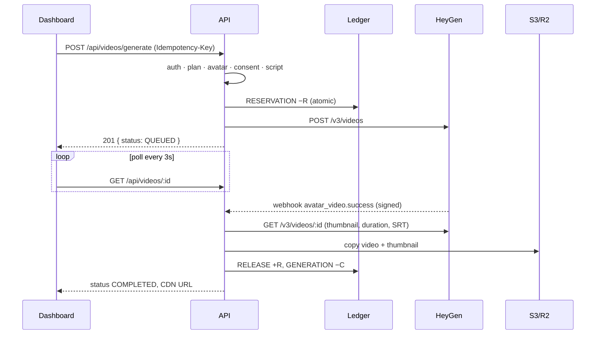

# Website Mini Agent

> Working name. Put an AI spokesperson on your website.

Website Mini Agent is a MERN SaaS that turns a short script into a pre-generated AI avatar video (via HeyGen) and serves it through a tiny embeddable widget. The widget appears on a customer's website as a floating spokesperson: a bubble pops in, grabs attention, opens into a card, plays the video with captions and shows one call to action.

**This is not a conversational agent.** There is no chat, no live Q&A, no voice conversation and no meeting booking. The avatar plays a pre-recorded script. Only two plans exist: **Starter** and **Growth**.

---

## Contents

1. [Product overview](#1-product-overview)
2. [Architecture](#2-architecture)
3. [Tech stack](#3-tech-stack)
4. [Folder structure](#4-folder-structure)
5. [Environment setup](#5-environment-setup)
6. [MongoDB setup](#6-mongodb-setup)
7. [Running the frontend](#7-running-the-frontend)
8. [Running the backend](#8-running-the-backend)
9. [Mock mode](#9-mock-mode)
10. [HeyGen setup](#10-heygen-setup)
11. [Stripe setup](#11-stripe-setup)
12. [S3 / R2 setup](#12-s3--r2-setup)
13. [Webhook setup](#13-webhook-setup)
14. [Deployment](#14-deployment)
15. [Widget embedding](#15-widget-embedding)
16. [API documentation](#16-api-documentation)
17. [Troubleshooting](#17-troubleshooting)

---

## 1. Product overview

| Step | What the customer does |
| --- | --- |
| 1 | Signs up and picks **Starter** or **Growth** |
| 2 | Buys a credit pack (Stripe Checkout; webhook-confirmed) |
| 3 | **Starter:** chooses a stock HeyGen avatar. **Growth:** uploads spokesperson footage, the spokesperson completes HeyGen's hosted consent flow, the digital twin trains |
| 4 | Writes a script with an optional CTA (live word count, duration and credit estimate) |
| 5 | Generates the video — credits are reserved, the job runs asynchronously |
| 6 | Watches progress; the finished video is copied into our own S3/R2 storage |
| 7 | Previews it, creates a widget, customises position / delay / theme / CTA / captions |
| 8 | Pastes one `<script>` tag into their site |

### Plans

| | Starter | Growth |
| --- | --- | --- |
| Avatar | Stock avatar library | Customer's own digital twin |
| Consent | Not required | **Required and enforced server-side** |
| Engine | `STARTER_HEYGEN_ENGINE` | `GROWTH_HEYGEN_ENGINE` |
| Credit rate | `STARTER_CREDITS_PER_MINUTE` | `GROWTH_CREDITS_PER_MINUTE` |
| Custom avatar slot | — | Purchased separately (`AVATAR_SLOT_PRICE_CENTS`) |
| Widget | Same | Same |

### Open product decisions (all configurable, nothing hard-coded)

| Decision | Where it lives |
| --- | --- |
| What a credit is worth | `CREDITS_PER_MINUTE`, `STARTER_/GROWTH_CREDITS_PER_MINUTE`, `MIN_CREDITS_PER_VIDEO`, `CREDIT_PACKAGES` |
| HeyGen engine per plan (Avatar III / IV / V) | `STARTER_HEYGEN_ENGINE`, `GROWTH_HEYGEN_ENGINE`, resolutions |
| Payment provider | `PAYMENT_PROVIDER` + `services/payment.service.js` contract |
| Product / brand name | UI copy (`Logo.jsx`, `index.html`, landing page) |
| Avatar vendor | `services/heygen.service.js` contract (swap the implementation) |
| Embed delivery | `WIDGET_BASE_URL` (serve `widget.js` from the API or a CDN) |
| Multi-language, voice cloning | Not implemented; voice falls back to the avatar default or `HEYGEN_DEFAULT_VOICE_ID` |
| Growth included slots | `GROWTH_INCLUDED_AVATAR_SLOTS` (default 0) |

---

## 2. Architecture

```mermaid
flowchart LR
  subgraph Customer website
    W[widget.js<br/>Shadow DOM]
  end
  subgraph Vercel
    C[React dashboard]
  end
  subgraph API [Express API · Render/Railway/Fly]
    R[REST routes] --> S[Domain services]
    S --> L[(Credit ledger)]
    S --> P{{Provider registry}}
    J[Job runner<br/>polling fallback] --> S
    WH[Webhooks] --> S
  end
  P --> H[HeyGenService<br/>real / mock]
  P --> PAY[PaymentService<br/>Stripe / mock]
  P --> ST[StorageService<br/>S3·R2 / mock]
  C -->|cookie JWT| R
  W -->|GET /api/public/widgets/:id| R
  W -->|video| CDN[(S3 / R2 CDN)]
  H -. avatar_video.success .-> WH
  PAY -. checkout.session.completed .-> WH
  S --> DB[(MongoDB Atlas)]
```

### Key design decisions

- **Provider abstraction.** Controllers never talk to vendors. `services/providers.js` returns the configured `HeyGenService`, `PaymentService` and `StorageService` (real or mock). Adding Razorpay means implementing four methods and registering it.
- **All HeyGen HTTP calls live in `server/src/services/heygen.service.js`**, with endpoint paths collected in `HEYGEN_ENDPOINTS`. Raw payloads are mapped into internal shapes by `services/adapters/heygen.adapter.js`, which tolerates several response structures.
- **Immutable credit ledger.** `User.credits` is a cached balance that only changes inside `credit.service.js`, always with `CreditTransaction` rows. Debits are conditional atomic `$inc`s, so balances can never go negative. A unique `dedupeKey` (e.g. `PURCHASE:Payment:<id>`) prevents double credit or double charge. With a replica set everything runs in a MongoDB transaction; on a standalone server a failed ledger write is compensated.
- **Credit lifecycle for a video:** `RESERVATION −R` at submit → on success `RELEASE +R` and `GENERATION −C` (C = real duration cost, capped at R) → on failure `RELEASE +R`. Each transition is guarded by `VideoGeneration.creditState`, so the webhook and the poller can race safely.
- **Idempotent generation.** The client sends an `Idempotency-Key` per attempt; a unique `(userId, idempotencyKey)` index means repeated clicks return the same generation and reserve once.
- **Async jobs without Redis.** `VideoGeneration` carries lease-lock fields (`lockedUntil`, `lockOwner`, `nextPollAt`). Webhooks are nudges; an in-process poller (`jobs/`) guarantees completion. It is safe on multiple instances.
- **Videos never depend on HeyGen hosting.** On completion the video and thumbnail are streamed into S3/R2, and the temporary provider URLs are discarded.
- **Public surface is minimal.** Widgets are addressed by `wgt_…` public ids; the public endpoint returns only presentation config — no Mongo ids, emails, provider ids or balances.

### Generation flow



---

## 3. Tech stack

| Layer | Choice |
| --- | --- |
| Frontend | React 19, Vite 7, React Router 7, Tailwind CSS 4, Axios, React Hook Form, Zod 4, Zustand, lucide-react |
| Backend | Node ≥ 20, Express 5, Mongoose 8, JWT (HTTP-only cookie), bcrypt, Helmet, express-rate-limit, Multer, Pino |
| Integrations | HeyGen API v3, Stripe Checkout, AWS SDK v3 (S3 / R2) |
| Widget | Framework-free vanilla JS, Shadow DOM, minified with esbuild (~16 KB, ~5 KB gzip) |
| Tests | Vitest, Supertest, mongodb-memory-server (replica set) |
| Monorepo | npm workspaces + concurrently |

---

## 4. Folder structure

```
website-mini-agent/            (this repository)
├── client/                    React dashboard + marketing site (Vercel)
│   ├── src/
│   │   ├── components/        AvatarCard, VideoCard, CreditBalance, VideoPlayer, WidgetPreview,
│   │   │   └── ui/            ScriptEditor, PlanCard, Navbar, Sidebar … / Button, Card, Modal, Input,
│   │   │                      Textarea, Select, Badge, ProgressBar, Toast, Loading/Empty/ErrorState
│   │   ├── pages/             Landing, Pricing, auth, dashboard/*, admin, mock/*
│   │   ├── layouts/           Marketing, Auth, Dashboard (sidebar + mobile drawer)
│   │   ├── hooks/             useApi (fetch + polling), useCopy, useDocumentTitle
│   │   ├── services/          axios client + one wrapper per API resource
│   │   ├── store/             auth, config, toast (zustand)
│   │   ├── routes/            Protected / Guest / Admin guards
│   │   ├── utils/  types/
│   └── vercel.json
├── server/                    Express API (Render / Railway / Fly.io)
│   ├── src/
│   │   ├── config/            env validation, plans, MongoDB + transactions, logger
│   │   ├── controllers/       thin HTTP layer
│   │   ├── middleware/        auth, validation, sanitisation, CSRF origin check, rate limits, uploads, errors
│   │   ├── models/            User, Avatar, VideoGeneration, Widget, CreditTransaction, Payment, WebhookEvent
│   │   ├── routes/            REST, public, webhook routers
│   │   ├── services/          domain services + provider implementations
│   │   │   ├── heygen.service.js        ← every HeyGen API call
│   │   │   ├── adapters/heygen.adapter.js
│   │   │   ├── storage.service.js · s3Storage.service.js
│   │   │   ├── payment.service.js · stripePayment.service.js
│   │   │   └── mock/                    mock HeyGen, payments, storage, avatar art
│   │   ├── jobs/              poller, consent sync, stale-payment expiry
│   │   ├── webhooks/          (see services/webhook.service.js + routes/webhook.routes.js)
│   │   ├── widget/widget.js   embeddable widget source
│   │   ├── scripts/seed.js
│   │   ├── app.js · server.js
│   ├── assets/                sample MP4 + poster used by mock mode
│   ├── public/                built widget.js
│   ├── scripts/build-widget.js
│   ├── tests/                 integration tests
│   └── Dockerfile
├── shared/                    used by both client and server
│   ├── constants/             plans, statuses, widget options, error codes
│   ├── schemas/               Zod schemas (auth, script, widget, …)
│   └── utils/                 script word count, duration estimate, caption timing
├── .env.example
├── render.yaml
└── package.json               workspaces + root scripts
```

---

## 5. Environment setup

Requirements: **Node 20.11+** (22 LTS recommended), npm 10+, MongoDB 6+ (local or Atlas).

```bash
npm install
```

```bash
cp .env.example .env
```

One `.env` at the repository root serves both apps; only `VITE_*` variables reach the browser. Every variable is documented inline in [.env.example](.env.example). The defaults run the whole product in **mock mode** with no external credentials.

In production the API refuses to start with unsafe or incomplete configuration: a missing or short `JWT_SECRET`, a real provider without its keys, or local-disk storage.

---

## 6. MongoDB setup

**Local:** run `mongod` and keep `MONGO_URI=mongodb://127.0.0.1:27017/website-mini-agent`.

A standalone server works. Multi-document transactions need a replica set, and without one the ledger falls back to compensated writes (a warning is logged). For production parity locally:

```bash
mongod --replSet rs0 --dbpath ./data
```

```bash
mongosh --eval "rs.initiate()"
```

Then use `MONGO_URI=mongodb://127.0.0.1:27017/website-mini-agent?replicaSet=rs0`.

**Atlas:** create a cluster (always a replica set), add a database user, allow your host's IP, and set `MONGO_URI=mongodb+srv://…/website-mini-agent`. Indexes are created automatically on boot.

**Seed demo data** (wipes the database — refused in production):

```bash
npm run seed
```

| Account | Plan | Notes |
| --- | --- | --- |
| `demo@example.com` | Starter | 550 credits, 2 completed videos, 1 failed (refunded), 2 widgets |
| `starter@example.com` | Starter | 100 credits, 1 video + widget |
| `growth@example.com` | Growth | 1000 credits, approved digital twin, 1 video + widget |
| `admin@example.com` | Growth / admin | Admin area |

Password for all: `Password123!`

---

## 7. Running the frontend

```bash
npm run dev -w client
```

The client runs at http://localhost:5173. In development Vite proxies `/api`, `/widget.js`, `/media` and `/mock-assets` to the API, so everything is same-origin. For production builds set `VITE_API_URL` to the API origin, then:

```bash
npm run build -w client
```

## 8. Running the backend

```bash
npm run dev -w server
```

The API runs at http://localhost:4000 (health check: `/health`). To run both apps together:

```bash
npm run dev
```

| Root command | Does |
| --- | --- |
| `npm install` | Installs all workspaces |
| `npm run dev` | API + client with live reload (concurrently) |
| `npm run seed` | Loads demo data |
| `npm run test` | Backend integration tests |
| `npm run build` | Minifies `widget.js` and builds the client |
| `npm start` | Starts the API (production) |

---

## 9. Mock mode

`MOCK_EXTERNAL_SERVICES=true` (the default) lets the whole product be demonstrated locally without HeyGen, Stripe or S3.

| Real service | Mock behaviour |
| --- | --- |
| HeyGen avatars | 10 stock avatars with generated SVG portraits |
| HeyGen generation | Async job: pending → processing → completed after `MOCK_GENERATION_SECONDS`, then a **signed** fake `avatar_video.success` webhook. If webhooks fail, the poller finishes the job. The output is `server/assets/sample-avatar.mp4` |
| Failure path | Put `[fail]` anywhere in a script to simulate a provider failure and see credits returned |
| HeyGen consent | Hosted consent is replaced by `/mock/heygen-consent`, where you approve or decline. The twin then "trains" for ~5s |
| Stripe Checkout | Redirects to `/dashboard/billing/mock-checkout`. "Pay" makes the API emit a signed mock webhook through the **same** webhook pipeline, so credits still come only from the webhook |
| S3 / R2 | Files are written to `server/storage/uploads` and served from `/media` (range requests supported) |

Switch services individually while going live (for example, real Stripe test mode with mock HeyGen):

```dotenv
MOCK_EXTERNAL_SERVICES=true
PAYMENT_PROVIDER=stripe
```

Dev-only endpoints under `/api/dev/*` exist only while the matching provider is mocked.

---

## 10. HeyGen setup

> Full endpoint-by-endpoint reference: [server/docs/heygen-api-reference.md](server/docs/heygen-api-reference.md)

1. Create an API key in HeyGen and set `HEYGEN_API_KEY`.
2. Set the provider:

   ```dotenv
   HEYGEN_PROVIDER=heygen
   ```

   You can also set `MOCK_EXTERNAL_SERVICES=false`.
3. Pick engines per plan. The engine assignment is an **open decision**, so these values are examples:

   ```dotenv
   STARTER_HEYGEN_ENGINE=avatar_iii
   GROWTH_HEYGEN_ENGINE=avatar_iv
   ```

   HeyGen v3 accepts `avatar_iii`, `avatar_iv` and `avatar_v`. Each stock look reports `supported_api_engines`; with `HEYGEN_FILTER_AVATARS_BY_ENGINE=true`, Starter only sees avatars that support the Starter engine. The server also rejects incompatible avatars before reserving credits.
4. Set `HEYGEN_DEFAULT_VOICE_ID` for avatars without a default voice.
5. Register the webhook (see [§13](#13-webhook-setup)) and set `HEYGEN_WEBHOOK_SECRET`.

| Our method | HeyGen endpoint (v3) |
| --- | --- |
| `getStockAvatars()` | `GET /v3/avatars/looks?ownership=public&avatar_type=studio_avatar` (paginated) |
| `createCustomAvatar()` | `POST /v3/avatars` `{ type: "digital_twin", file: { type: "url" } }` |
| `createConsentFlow()` | `POST /v3/avatars/{group_id}/consent` → hosted consent URL (valid 24h) |
| `getAvatarConsentStatus()` | `GET /v3/avatars/{group_id}` + `GET /v3/avatars/looks/{look_id}` |
| `generateVideo()` | `POST /v3/videos` `{ type: "avatar", engine, resolution, motion_prompt, caption }` |
| `getGenerationStatus()` | `GET /v3/videos/{video_id}` |
| `handleWebhook()` | HMAC-SHA256 of the raw body, hex, `signature` header |

These paths were checked against developers.heygen.com in September 2026 and all live in `HEYGEN_ENDPOINTS`. Only `pending` is documented as a consent status, so the adapter maps a tolerant set (`approved`/`completed`/`verified` → APPROVED, and so on). Verify both with your account before launch.

**Spokesperson footage** is uploaded to object storage under an unguessable key and handed to HeyGen as a short-lived presigned URL.

---

## 11. Stripe setup

1. Set the keys and provider:

   ```dotenv
   STRIPE_SECRET_KEY=sk_live_or_test_...
   PAYMENT_PROVIDER=stripe
   ```

2. Configure products through `CREDIT_PACKAGES` (JSON) and `AVATAR_SLOT_PRICE_CENTS`. Checkout uses dynamic `price_data`, so no Stripe products are required.
3. Add a webhook endpoint `https://<api>/api/webhooks/stripe` with these events:
   - `checkout.session.completed`
   - `checkout.session.async_payment_succeeded`
   - `checkout.session.async_payment_failed`
   - `checkout.session.expired`
   - `charge.refunded`

   Then set `STRIPE_WEBHOOK_SECRET`.
4. For local testing, forward events with the Stripe CLI and use the printed `whsec_…` as the secret:

   ```bash
   stripe listen --forward-to localhost:4000/api/webhooks/stripe
   ```

Rules the code enforces:
- Credits are granted **only** by a verified webhook, never by the redirect.
- The amount must match the pending payment.
- A payment moves `PENDING → COMPLETED` exactly once.
- Full refunds claw back credits (never below zero). Partial refunds are recorded for manual adjustment.

To add **Razorpay** later, implement `createCheckoutSession`, `handleWebhook`, `getPayment` and `refund` in a new class and register it in `services/providers.js`.

---

## 12. S3 / R2 setup

```dotenv
STORAGE_PROVIDER=s3
S3_BUCKET=website-mini-agent
S3_ACCESS_KEY=...
S3_SECRET_KEY=...
S3_PUBLIC_URL=https://cdn.example.com        # public/CDN base for stored objects
# AWS
S3_REGION=us-east-1
# Cloudflare R2
S3_ENDPOINT=https://<account-id>.r2.cloudflarestorage.com
S3_REGION=auto
```

- Make `videos/` and `thumbnails/` publicly readable through your CDN (CloudFront, or an R2 custom domain / `r2.dev`). The `footage/` prefix never needs public access, because presigned URLs are used.
- Add a bucket CORS rule allowing `GET`/`HEAD` from `*` so widgets on any domain can stream videos.
- Objects are written with `Cache-Control: public, max-age=31536000, immutable`.

### Alternative: Cloudinary (good for low-volume testing)

Not S3-compatible, so it's a separate adapter (`cloudinaryStorage.service.js`) rather than a config swap:

```dotenv
STORAGE_PROVIDER=cloudinary
CLOUDINARY_CLOUD_NAME=...
CLOUDINARY_API_KEY=...
CLOUDINARY_API_SECRET=...
```

Get these three values from your Cloudinary dashboard (Settings → API Keys) — no card required for the free tier. Videos/thumbnails upload as public assets; spokesperson footage (`footage/` keys) uploads as Cloudinary's `authenticated` type and is served via a signed URL. **Caveat:** that signed URL is obscure but Cloudinary doesn't guarantee it expires on every account tier the way an S3 presigned URL does — true time-limited expiry needs their token-authentication add-on. Fine for testing; verify before relying on it for real spokesperson footage privacy in production.

---

## 13. Webhook setup

| Provider | Endpoint | Verification | Idempotency |
| --- | --- | --- | --- |
| HeyGen | `POST /api/webhooks/heygen` | `signature` = hex HMAC-SHA256(raw body, `HEYGEN_WEBHOOK_SECRET`) | `heygen-event-id` header, else `event_type:video_id` |
| Stripe | `POST /api/webhooks/stripe` | `stripe-signature` via `stripe.webhooks.constructEvent` | Stripe event id |

Register the HeyGen endpoint once. The response contains the signing secret, and it is shown only once:

```bash
curl -X POST https://api.heygen.com/v3/webhooks/endpoints -H "X-Api-Key: $HEYGEN_API_KEY" -H "Content-Type: application/json" -d '{"url":"https://api.example.com/api/webhooks/heygen","events":["avatar_video.success","avatar_video.fail","instant_avatar.success","instant_avatar.fail"]}'
```

Every delivery is stored in `WebhookEvent` with a unique `(provider, eventId)` index. A redelivery of a processed event is acknowledged without side effects. HeyGen events are acknowledged immediately and processed in the background (HeyGen requires a 2xx within 10s). If processing fails, the **polling fallback** still completes the job. Admins can inspect events under **Admin → Webhooks**.

---

## 14. Deployment

### MongoDB Atlas
Use an M10+ (or serverless) cluster. Transactions are available automatically.

### API on Render
`render.yaml` is a Blueprint: **New → Blueprint → select the repo**, then fill in the `sync: false` secrets. The build command is `npm ci && npm run build -w server`, the start command is `npm start -w server`, and the health check is `/health`.

### API on Railway / Fly.io / containers
Build the image from the repository root:

```bash
docker build -f server/Dockerfile -t website-mini-agent-api .
```

Set the same environment variables and `TRUST_PROXY=1`.

> Background jobs run inside the API process and coordinate through MongoDB leases, so multiple instances are safe. To dedicate one worker, set `JOBS_ENABLED=false` on web instances.

### Client on Vercel
- **Root directory:** `client`. Vercel installs the npm workspace from the repository root.
- **Build:** `npm run build`. **Output:** `dist` (see `client/vercel.json`).
- **Env:** `VITE_API_URL=https://api.example.com`.

**Cookies across domains.** The session is an HTTP-only cookie. Pick one of:
1. **Same site (recommended):** `app.example.com` + `api.example.com`. Keep `COOKIE_SAMESITE=lax`.
2. **Different sites** (e.g. `*.vercel.app` + `*.onrender.com`): set `COOKIE_SAMESITE=none` (the API forces `Secure`). Every cookie-authenticated write is also checked against `CLIENT_URL` (CSRF defence).
3. **Proxy:** add a Vercel rewrite `{"source":"/api/(.*)","destination":"https://api.example.com/api/$1"}` and leave `VITE_API_URL` empty.

Production checklist:
- `NODE_ENV=production`
- a long random `JWT_SECRET`
- `CLIENT_URL`, `API_URL` and `WIDGET_BASE_URL` set to HTTPS origins
- real providers configured
- webhooks registered
- the bucket's CORS rule in place

---

## 15. Widget embedding

Every widget has a public id. The customer pastes one tag before `</body>`:

```html
<script src="https://api.example.com/widget.js" data-widget-id="wgt_XXXXXXXXXXXXXXXXXXXX" async></script>
```

The widget:
- loads asynchronously and fetches its config immediately;
- renders only after `window.load` plus the configured delay;
- only downloads the video when the card opens.

Behaviour: bubble → attention animation (wave / pulse / bounce) → card → video (autoplays muted, with a "Tap for sound" prompt) → captions synced to the script → CTA → collapse / reopen. Collapsed state is remembered for the session, and visitors can dismiss the bubble.

Styles live in a Shadow DOM, so nothing leaks either way. There's no framework, and no npm install is needed on the customer's site. Mobile behaviour is configurable: compact card, bubble only, or hidden.

- If `widget.js` is served from a CDN different from the API, add `data-api="https://api.example.com"` (the dashboard includes it automatically when `WIDGET_BASE_URL ≠ API_URL`).
- Customer sites with a strict Content-Security-Policy need to allow:
  - `script-src` and `connect-src` for the API origin
  - `media-src` and `img-src` for the storage CDN
- Disabling a widget in the dashboard hides it everywhere without touching the snippet. Settings changes go live within about a minute (public config is cached for 60s).

---

## 16. API documentation

All responses use one envelope.

```json
{ "success": true, "data": { } }
```

```json
{ "success": false, "error": { "code": "INSUFFICIENT_CREDITS", "message": "You do not have enough credits.", "details": { } } }
```

- **Auth:** HTTP-only cookie `wma_session` (or `Authorization: Bearer <jwt>` for API clients). Cookie-authenticated writes must come from an allowed origin.
- **Ownership:** every resource is scoped to the caller. Another user's resource returns `404`.

| Method | Path | Auth | Description |
| --- | --- | --- | --- |
| GET | `/api/config` | — | Plans, script limits, mock flags, widget script URL |
| POST | `/api/auth/register` | — | `{ name, email, password, plan }` → sets cookie |
| POST | `/api/auth/login` | — | `{ email, password }` → sets cookie |
| POST | `/api/auth/logout` | — | Clears cookie |
| GET | `/api/auth/me` | user | Current user |
| GET | `/api/users/me` | user | Profile + plan + credit summary |
| PATCH | `/api/users/me` | user | `{ name?, plan?, currentPassword?, newPassword? }` (password change signs out other sessions) |
| GET | `/api/dashboard` | user | Dashboard summary |
| GET | `/api/avatars` | user | Starter: stock library · Growth: own twins (+ slots) |
| POST | `/api/avatars/custom` | Growth | multipart `name`, `footage` (MP4/MOV/WebM, magic-byte checked) → creates twin + consent link |
| GET | `/api/avatars/:id` | user | Avatar |
| GET | `/api/avatars/:id/consent-status` | owner | Refreshes from provider (throttled) |
| POST | `/api/avatars/:id/consent` | owner | New consent link (expired / rejected) |
| GET | `/api/videos` | user | `?status=all\|processing\|completed\|failed&page&limit` |
| POST | `/api/videos/generate` | user | `{ avatarId, title?, script, gesture?, ctaText?, ctaUrl? }` + `Idempotency-Key` header |
| GET | `/api/videos/:id` | owner | Video + status (poll while generating) |
| DELETE | `/api/videos/:id` | owner | Deletes video, stored files and its widgets (409 while generating) |
| POST | `/api/widgets` | user | `{ videoId, …settings }` (completed videos only) |
| GET | `/api/widgets` | user | List |
| GET/PATCH/DELETE | `/api/widgets/:id` | owner | Read / update / delete |
| GET | `/api/credits` | user | Available, reserved, lifetime totals, pricing |
| GET | `/api/credits/ledger` | user | `?type&page&limit` |
| GET | `/api/billing/packages` | — | Credit packs, avatar slot, plans |
| POST | `/api/billing/checkout` | user | `{ packageId }` → `{ url }` (alias: `/create-checkout-session`) |
| GET | `/api/billing/transactions` | user | Payment history |
| GET | `/api/billing/credits` | user | Same as `/api/credits` |
| GET | `/api/public/widgets/:publicId` | — (CORS `*`) | Public widget config |
| GET | `/widget.js` | — (CORS `*`) | Embeddable script |
| POST | `/api/webhooks/heygen` | signature | HeyGen events |
| POST | `/api/webhooks/stripe` | signature | Payment events |
| GET | `/api/admin/overview` · `/users` · `/generations` · `/webhook-events` · `/payments` · `/avatars` | admin | Operations |
| GET | `/api/admin/users/:id/ledger` | admin | Ledger + reconciliation |
| POST | `/api/admin/users/:id/credits` | admin | `{ amount, reason }` → ADJUSTMENT entry |
| POST | `/api/admin/generations/:id/cancel` · `/resync` | admin | Stuck-job tools |

Error codes are defined in `shared/constants` (`ERROR_CODES`).

---

## 17. Troubleshooting

| Symptom | Fix |
| --- | --- |
| `MongoServerSelectionError` | Is `mongod` running / is your IP on the Atlas allow list? Check `MONGO_URI`. |
| "transactions unavailable" warning | Standalone MongoDB — fine for development; use a replica set or Atlas in production ([§6](#6-mongodb-setup)). |
| Logged out immediately in production | Dashboard and API on different sites: set `COOKIE_SAMESITE=none` over HTTPS, or use a same-site subdomain / Vercel rewrite ([§14](#14-deployment)). |
| `CSRF_REJECTED` | The request origin is not in `CLIENT_URL` (comma-separate multiple origins). |
| Video stuck in "Generating" | Check **Admin → Webhooks** and **Generations**; the poller retries with backoff and times out after `GENERATION_TIMEOUT_MINUTES` (credits returned). Use **Resync** or **Cancel**. |
| `WEBHOOK_SIGNATURE_INVALID` | The secret must be the one returned when the endpoint was registered; the body must reach the API unmodified (no JSON re-serialising proxies). |
| Stock avatar list empty | Check `HEYGEN_API_KEY`, or set `HEYGEN_FILTER_AVATARS_BY_ENGINE=false` if no public look supports your Starter engine. |
| Widget not showing on a site | Widget enabled? Video completed? Open DevTools: CSP blocking the API/CDN? The console logs `[MiniAgent] widget not shown: …`. |
| Videos won't play on customer sites | Bucket CORS / public access on the CDN ([§12](#12-s3--r2-setup)). |
| Mock video missing | `server/assets/sample-avatar.mp4` must exist (committed with the repo). |
| Tests download MongoDB | mongodb-memory-server fetches a binary on first run. To reuse a local install, set `MONGOMS_SYSTEM_BINARY=/path/to/mongod`. |

### Testing

```bash
npm run test
```

The suite runs against an in-memory MongoDB replica set, so transactions are exercised. Credit tests also run in the standalone fallback mode. Coverage:
- authentication and sessions
- authorization and ownership
- credit calculation, reservation, release, settlement, concurrency and immutability
- video generation, idempotency and consent enforcement
- the HeyGen and Stripe webhooks, including idempotency
- the public widget endpoint (no data leakage)
- uploads, CSRF, operator injection and admin adjustments

### Security summary
- Helmet
- Rate limiting: auth, generation, public widget and general API
- Zod validation on every input
- `$`-key stripping plus `strictQuery`
- Strict CORS for the dashboard; open, credential-less CORS for public surfaces
- HTTP-only cookies, with token versioning to revoke sessions
- Webhook signatures
- Upload type, size and magic-byte checks
- Owner-scoped queries everywhere
- Immutable ledger
- Explicit response serialisers
